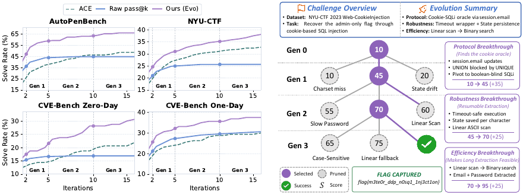

<a name="readme-top"></a>

<p align="center">
  
</p>

<h2 align="center">CyberEvolver: Structured Self-Evolution for Cybersecurity Agents On the Fly</h2>

<p align="center">
  <b>A self-evolving cybersecurity agent framework that rewrites its own scaffold from failed rollouts.</b>
</p>

<p align="center">
  
</p>

---

> This repository is an anonymized code release accompanying a paper currently under
> double-blind review. Author, affiliation, and paper links are intentionally omitted.

## Why CyberEvolver?

LLM-based cybersecurity agents are increasingly used for CTF challenges, penetration testing, and vulnerability exploitation. Most existing systems still use fixed human-designed scaffolds: the prompt, tool-use rules, observation processing, and skills remain unchanged even after the agent fails.

**CyberEvolver** asks whether a cyber agent can improve on the target it is currently attacking. It performs **on-policy scaffold self-evolution**: each failed rollout is compressed, diagnosed, and used to mutate the agent itself before the next generation runs.

Cybersecurity makes this both attractive and hard:

- **Targets are heterogeneous.** Different services, binaries, networks, and vulnerability classes need different tactics.
- **Verifiers are clean.** A flag matches, a shell opens, or a privilege escalation completes.
- **Feedback is sparse and obscured.** A failed exploit may return only silence, a reset connection, or misleading service output.

CyberEvolver addresses this with a structured evolution loop instead of free-form prompt rewriting.

## Key Features

- **Four evolvable layers.** The agent scaffold is decomposed into strategy, environment interface, perception, and domain knowledge layers.
- **Trace-to-diagnosis mutation signal.** Noisy execution trajectories are compressed into evidence-grounded diagnostic reports with progress scores.
- **Population-based beam search.** Multiple agent variants compete across generations, preserving diverse hypotheses and pruning weak branches.
- **Executable scaffold mutation.** Mutations can update prompts, observation processing, skill libraries, and interface rules, not just textual notes.
- **Unified cyber evaluation suite.** The repository reorganizes CTF, penetration-testing, and CVE exploitation benchmarks for scalable evaluation.

## Main Results

CyberEvolver is evaluated on NYU-CTF, AutoPenBench, and CVEBench with four frontier open-source backbones: Kimi-K2.5, MiniMax-M2.5, DeepSeek-V3.1, and Qwen3-235B-A35B-Instruct-2507.

| Benchmark | Seed pass@16 | ACE | CyberEvolver | Gain over seed |
|---|---:|---:|---:|---:|
| NYU-CTF | 25.7 | 25.2 | **38.1** | +12.4 |
| AutoPenBench | 44.7 | 38.7 | **65.9** | +21.2 |
| CVEBench Zero-Day | 16.9 | 15.6 | **30.6** | +13.7 |
| CVEBench One-Day | 30.6 | 25.0 | **37.5** | +6.9 |

Across all settings, CyberEvolver:

- improves over the seed agent's pass@16 by **13.6%** on average;
- uses **17.5% fewer tokens** than seed-agent pass@16 on average;
- beats the strongest human-designed cyber agent in every model x benchmark cell by **14.0%** on average;
- outperforms generic self-improvement baselines adapted from other domains.

Result figures are under `docs/static/images/`.

## Table of Contents

- [Setup](#setup)
- [Quick Start](#quick-start)
- [Run CyberEvolver](#run-cyberevolver)
- [Benchmark Control Plane](#benchmark-control-plane)
- [Repository Layout](#repository-layout)

## Setup

### Prerequisites

- Python 3.10+
- Docker and Docker Compose for benchmark targets
- An OpenAI-compatible LLM endpoint, configured in `common/configs/model.yml`

### Installation

Download or clone this anonymized repository, then:

```bash
cd CyberEvolver
pip install -r requirements.txt
```

### Configure LLM Endpoints

```bash
cp common/configs/model.yml.example common/configs/model.yml
$EDITOR common/configs/model.yml
```

`common/configs/model.yml` is gitignored. Each profile specifies a model name, base URL, and API key.

## Quick Start

Start the benchmark control plane in one terminal:

```bash
export CTF_HOST_IP=127.0.0.1
export CHALLENGE_SERVER_URL=http://127.0.0.1:8000
PYTHONPATH=. python bench_hub/server/challenge_server.py 127.0.0.1 8000
```

Run a single debug attempt in another terminal:

```bash
export CHALLENGE_SERVER_URL=http://127.0.0.1:8000
python run_single_debug.py \
  --config mini_cyberagent/configs/mini_ctf.yaml \
  --model DeepSeek-V3.1 \
  --challenge-id ic-crypto-5 \
  --step-limit 20
```

## Run CyberEvolver

CyberEvolver runs an execution-diagnosis-mutation loop over each target. The default configuration uses a bounded population search: rollout current variants, diagnose failed traces, select promising parents, mutate layer-wise, and repeat until success or the generation budget is exhausted.

```bash
python run_evolve_batch.py \
  --config cyber_evolver/configs/evolve.yaml \
  --config-mode evo \
  --challenge-server-url http://127.0.0.1:8000 \
  --benchmark cybench \
  --base_seed_path cyber_evolver/seed_agent_templates/mini_cyberagent \
  --evolve_prompt_cfg cyber_evolver/configs/prompt.yml \
  --model DeepSeek-V3.1
```

### Evaluation Modes

| Mode | Purpose |
|---|---|
| `evo` | Full CyberEvolver with beam search and layer-wise mutation |
| `evo_no_beam` | Greedy self-evolution ablation |
| `raw` | Fixed seed agent repeated sampling baseline |

## Benchmark Control Plane

`bench_hub/` materializes benchmark targets on demand and isolates agent runs from one another. It supports per-agent target instances for benchmarks that require independent Docker Compose projects, while sharing runtimes when safe.

Large benchmark fixture trees are not intended to be edited as part of README work. Before full evaluation, place the required benchmark fixtures under `bench_hub/benchmarks/` according to the benchmark adapter you run.

## Repository Layout

```text
CyberEvolver/
├── cyber_evolver/          # self-evolution engine and mutation pipeline
├── mini_cyberagent/        # seed cybersecurity agent runtime
├── bench_hub/              # benchmark adapters and challenge server
├── common/                 # LLM dispatcher, Docker runtime, shared utilities
├── run_evolve/             # batch evolution driver modules
├── run_evolve_batch.py     # main CyberEvolver entry point
├── run_batch.py            # fixed-scaffold batch baseline
├── run_single_debug.py     # single-target debug runner
└── docs/                   # result figures referenced by this README
```

## Citation

Citation information is withheld while the paper is under double-blind review.

## Acknowledgements

CyberEvolver builds on the broader ecosystem of LLM agent research, cybersecurity benchmarks, and open-source evaluation infrastructure. Benchmark fixtures and external baselines retain their respective licenses.

<p align="right"><a href="#readme-top">Back to top</a></p>
