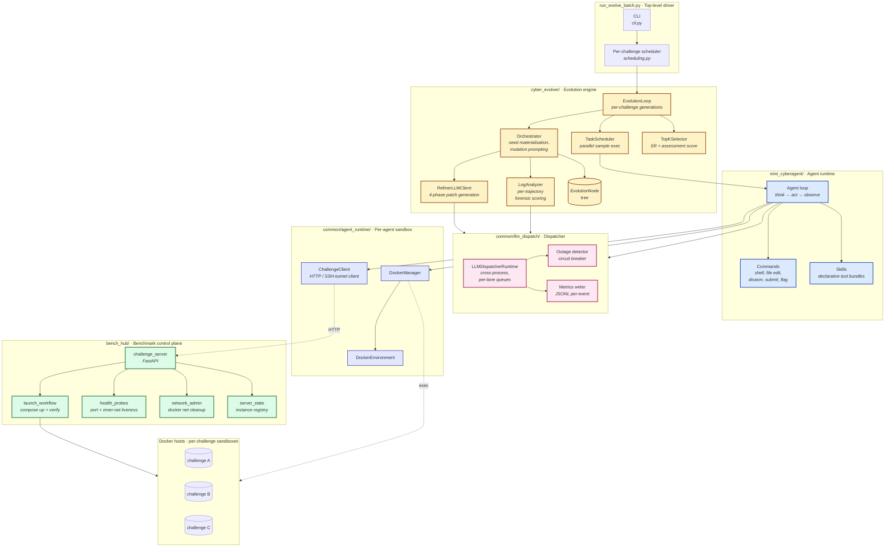
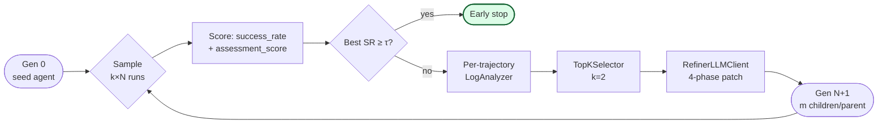

# Cybersec Arena
### *An Evolutionary Framework for Self-Improving CTF Agents*

> A research platform for **evolving** LLM-driven cybersecurity agents through
> generations of mutation, sandboxed evaluation, and forensic feedback —
> co-located with a **benchmark control plane** that materialises Docker-Compose
> targets on demand and a **resilient LLM dispatcher** that absorbs
> rate-limits, fatal outages, and cross-process scheduling pressure.

---

## Abstract

LLM agents trained on natural-language traces still **fail at the
long-horizon, tool-heavy reasoning** required by CTF (Capture-the-Flag)
challenges: writing a working exploit, pivoting through a network, recovering
a flag from a hardened binary. The dominant pattern in industry
(react / mini-swe-agent / etc.) is to evaluate one agent against one
challenge with one fixed prompt; the agent itself does not improve.

**Cybersec Arena** is a research framework that closes this loop. We treat
*the agent itself* — its commands, skills, and prompts — as the unit of
optimisation. A population of agent variants is evaluated in parallel against
sandboxed, lifecycle-managed challenge targets. Per-trajectory forensic
analysis ranks the variants and seeds an LLM-driven mutation step that
proposes the next generation. Across 4-16 generations we observe agents
synthesising new skills (binary analysis utilities, pwntools harnesses, web
fuzzers) that were absent from the seed and that solve challenges the seed
could not.

The repository is engineered for this workload end-to-end: a 5-segment
codebase, a centralised cross-process LLM dispatcher with circuit-breaker
behaviour, a FastAPI benchmark server with per-agent target isolation, and
lightweight verification paths that do not require a live LLM, Docker daemon,
or benchmark fixture data.

---

## 1. System overview



The five top-level packages map to the five concerns above:

| Package | Concern | Loc (≈) |
|---|---|---|
| `mini_cyberagent/` | Agent loop, commands, skills | ~2k |
| `cyber_evolver/` | Evolution loop, refiner, log analyser | ~5k |
| `common/llm_dispatch/` | Cross-process LLM dispatcher | ~1.7k |
| `common/agent_runtime/` | Per-agent Docker sandboxes + challenge client | ~1.6k |
| `bench_hub/` | FastAPI challenge server + benchmark adapters | ~3.5k |

The orchestration layer at the repo root (`run_evolve_batch.py`,
`run_batch.py`, `run_single_debug.py`) is intentionally thin; the
heavy logic lives inside `run_evolve/` (10 modules averaging 150 lines).

---

## 2. Evolutionary loop

The core algorithm is a beam-search over agent variants. Per challenge:



**State.** Each generation is a list of `EvolutionNode`s, where a node is a
filesystem snapshot of the agent's `commands/`, `skills/`, and prompt
templates plus aggregated metrics (`success_rate`, `assessment_score`,
`avg_steps`, `avg_token_num`).

**Sampling.** For each node, `samples_per_node` independent agent runs are
queued on a thread-pool. Each run gets a fresh sandbox (`workspace_<token>_<uuid>`)
and, when the challenge declares `target_scope=per_agent`, an isolated
challenge target (one Docker compose project per agent).

**Forensic scoring.** The `LogAnalyzer` invokes the LLM with a chunked agent
trajectory and returns an `assessment_score ∈ [0, 100]` capturing
*reasoning quality* independently of binary success/failure. This is what
keeps evolution useful when the population fails uniformly.

**Mutation.** The `RefinerLLMClient` runs a 4-phase patch pipeline:
*diagnose → propose → validate → apply*. Patches are constrained by Phase-3
validators that compile the resulting Python tree, render the Jinja
templates, and reject Unicode/line-scope escapes. Failed plans are dumped to
disk for later inspection.

**Selection.** `TopKSelector` orders nodes lexicographically by
`(success_rate ↓, assessment_score ↓)`. The default beam is `k=2`,
`children_per_node=3`, `samples_per_node=1`, `max_generations=4` — i.e. up
to 4 + 6 + 12 + 24 = 46 candidate trajectories before the early-stop
threshold (default `success_rate ≥ 0.3`) is checked.

**Ablations.** Three pre-built configs are shipped:

| Config mode | Beam | Children | Samples | Generations | Purpose |
|---|---|---|---|---|---|
| `evo` | 2 | 3 | 1 | 4 | Full method |
| `evo_no_beam` | 1 | 1 | 1 | 16 | Greedy sequential (Ablation C) |
| `raw` | 2 | 3 | 16 | 1 | No evolution; pure inference variance |

---

## 3. The cross-process LLM dispatcher

A naïve `langchain_openai.ChatOpenAI` instance per worker process is
unworkable here: a single evolution run can issue 10 000+ LLM calls across 16
parallel workers, and every provider we test (OpenAI, Bedrock, DeepSeek,
Aliyun PAI-EAS, on-prem vLLM) rate-limits, returns `5xx`, or experiences
hard outages on a regular basis.

`common/llm_dispatch/` is a centralised dispatcher with three properties:

1. **Cross-process scheduling.** A single dispatcher process owns all HTTP
   traffic; client processes communicate over a multiprocessing queue.
   Per-lane (challenge / role) inflight caps and a global cap guarantee
   fair scheduling.
2. **Circuit breaker.** A windowed outage detector
   (`DispatcherOutageDetector`) tracks recent retryable failures, total
   failures, consecutive failures, and failure-rate. If thresholds trip,
   a low-cost probe request confirms the outage; on confirmation the
   dispatcher transitions to `LLMDispatcherFatalError` and *every* pending
   request fails fast. Probe-based confirmation prevents single-host network
   blips from killing long-running runs.
3. **Observable.** Every event (`enqueue`, `dispatch`, `retry`, `fail`,
   `complete`, `fatal_outage`) is appended to a JSONL log; aggregate
   counters and inflight snapshots are formatted into one-line dispatcher
   summaries useful for live tail.

Internal layout:

```
common/llm_dispatch/
├── dispatcher.py          # runtime, scheduler, HTTP request, worker-process main
├── messages.py            # Mapping → OpenAI-compatible serialisation
├── request_payload.py     # payload assembly + token estimation
├── remote_errors.py       # 4xx/5xx parsing, classification, message building
├── metrics.py             # JSONL writer, summary formatter
├── outage.py              # circuit breaker (window detector + probe)
└── errors.py              # exception hierarchy + fatal-state propagation
```

Each module is independently testable; `dispatcher.py` re-exports the moved
symbols so external code (and existing test patches) is unaffected.

---

## 4. The benchmark control plane

`bench_hub/server/` is a FastAPI service that exposes a tiny launch/stop
API and owns *all* Docker-side state for challenge targets:

```
GET    /launch/{chal_id}?force_recreate&parallel_mode&target_scope
DELETE /launch/{chal_id}?run_id
```

**Two scoping modes.** Some challenges (`autopenbench`, `cvebench`) require
*one runtime per agent*; the server materialises a fresh compose project
with a per-run `project_local` subnet and per-run external port allocation.
Other challenges share a single runtime across all agents (default;
serialised by a per-challenge lock).

**Recovery semantics.** A background `monitor_instances` coroutine probes
every running instance once a minute (containers running + Docker
healthcheck + inner-network reachability + external port stability). If a
probe fails, the instance is restarted with port reuse. Per-challenge
restarts are serialised by `ChallengeRecoveryCoordinator` to prevent the
thundering-herd problem when many agents concurrently observe an unhealthy
target.

**Adapter abstraction.** New benchmarks are added by writing a
`bench_hub/adapters/<bench>.py` that produces a `LaunchSpec`. The server
itself stays benchmark-agnostic — it only knows compose projects,
networks, and port allocation.

```
bench_hub/server/
├── challenge_server.py   # FastAPI app + routes + lifecycle + monitor
├── launch_workflow.py    # _launch_challenge_impl + cleanup_instance
├── health_probes.py      # wait_for_*, probe_*, is_instance_healthy
├── network_admin.py      # docker network/container helpers
├── server_state.py       # env config, docker client, instance registry
├── schemas.py            # Pydantic models
├── launch_runtime.py     # compose materialisation + subnet allocation
└── runtime_guards.py     # per-challenge locks + recovery coordinator
```

---

## 5. The agent runtime

`common/agent_runtime/` provides each evaluation sample with an isolated
sandbox:

- **`DockerManager` + `DockerEnvironment`** — the agent talks to a long-lived
  worker container; per-sample workspaces are bind-mounted in. Cleanup is
  best-effort: failed containers are renamed `/tmp/finished_*` so a
  background sweeper can remove them after the sample exits.
- **`ChallengeClient`** — agent-side façade for the benchmark server. It
  optionally forwards through an SSH tunnel (necessary in our deployment
  because the GPU host cannot reach the benchmark host directly), and
  remembers per-challenge runtime args (target scope, parallel mode) so
  `auto_init=True` calls behave identically across the run.
- **`ChallengeRuntimeCoordinator`** — verifies the target is healthy
  *before* the agent starts and triggers a force-recreate if it is not. This
  is the difference between "agent flailing on a half-running web service for
  30 steps" and "agent productively interacting with a live target".

---

## 6. Technical challenges

| Challenge | Where it shows up | How we address it |
|---|---|---|
| **Provider outage cascades** kill long runs | Multi-hour evolution → single 503 sweep ends everything | Centralised dispatcher with windowed circuit breaker + probe-confirmation |
| **Concurrent target launches race** for ports/subnets | `target_scope=per_agent` benchmarks under high parallelism | `find_free_port()` guarded by a lock + project-local subnet reservation released on every error path |
| **Stale Docker networks** from crashed prior runs prevent fresh starts | Server restart after operator kill | `cleanup_orphan_networks()` on startup; *strict* fail-fast if a network with attached containers exists (other server suspected running) |
| **Mutation produces broken patches** | LLM proposes invalid Python or template syntax | 4-phase pipeline; Phase-3 validators compile + render in a temp tree before commit; failed plans dumped to disk |
| **Test isolation under sys.modules pollution** | One test installs fake `httpx`, breaks the next | Every fake-module install is wrapped `try: import real / except ImportError: install fake`; `sys.modules.setdefault` for sub-modules |
| **The agent must improve, not just imitate** | Standard prompts cap at the seed's own ceiling | `LogAnalyzer` provides a continuous reasoning-quality signal even when binary success is 0%, so selection is meaningful before the first solve |
| **Reproducibility at >10 LLM providers** | Token counting, latency budgeting, fatal-outage policies all differ | Single dispatcher with per-event JSONL metrics + token-budget enforcement; one file (`common/configs/model.yml`) parameterises every endpoint |

---

## 7. Repository layout

```
cybersec_arena/
├── mini_cyberagent/        # agent framework (Agent, Command, Skill)
│   ├── agent.py
│   ├── command.py
│   ├── skill.py
│   ├── commands/           # disassemble, edit, submit_flag, ...
│   ├── skills/             # declarative tool bundles
│   └── configs/            # per-agent run configs
│
├── cyber_evolver/          # evolution engine
│   ├── evolve/
│   │   ├── orchestrator.py
│   │   ├── refiner_agent.py     # 4-phase mutator
│   │   ├── loganalyzer.py       # per-trajectory scorer
│   │   ├── scheduler.py         # parallel sample exec
│   │   ├── selector.py          # TopK
│   │   ├── node.py              # EvolutionNode + NodeManager
│   │   └── codepatcher.py       # patch application
│   ├── configs/                 # evolution and mutation prompt configs
│   └── seed_agent_templates/
│       └── mini_cyberagent/     # seed agent template
│
├── run_evolve/             # evolution driver modules
│   ├── cli.py · config_loader.py · scheduling.py · runtime_args.py
│   ├── lifecycle.py · dispatcher_helpers.py
│   ├── single_challenge.py · evolution_loop.py · node_task.py
│   └── __init__.py
│
├── common/
│   ├── llm_dispatch/       # cross-process LLM dispatcher (7 modules)
│   ├── agent_runtime/      # Docker sandbox + challenge client
│   ├── utils/              # logging, prompt rendering, runtime policy, etc.
│   ├── configs/
│   │   ├── model.yml.example   # tracked template
│   │   └── model.yml           # gitignored, contains live API keys
│   └── scripts/
│
├── bench_hub/              # benchmark control plane
│   ├── server/             # FastAPI service (split into 6 cohesive modules)
│   ├── adapters/           # per-benchmark LaunchSpec builders
│   ├── benchmarks/         # JSON specs + prompt profiles + scripts
│   └── scripts/
│
├── docs/                   # ARCHITECTURE.md + plans/
├── requirements.txt · pyproject.toml · conftest.py
└── .github/workflows/ci.yml
```

The split policy: each segment owns its code, configs, and scripts.
`common/` is the *only* truly shared layer — and it has no upstream
dependencies on the other segments. There are no import cycles.

---

## 8. Quick start

### Install

```bash
git clone <repo-url> cybersec_arena
cd cybersec_arena
pip install -r requirements.txt
```

### Configure LLM endpoints

```bash
cp common/configs/model.yml.example common/configs/model.yml
$EDITOR common/configs/model.yml
```

The local file is gitignored. Each profile names the model, an
OpenAI-compatible base URL, and an API key.

### Place benchmark fixtures (optional)

The benchmark JSON specs and management scripts are tracked. The large
benchmark fixture trees (`bench_hub/benchmarks/{autopenbench,cvebench,
cybench,intercode_ctf,nyu_ctf,xbow-benchmark}/`) total ~3.2 GB and are
gitignored. Place them manually before running.

### Start the challenge server

`ChallengeClient` uses remote mode. In a separate terminal, start the
benchmark control plane before running debug, batch, or evolution commands:

```bash
export CTF_HOST_IP=127.0.0.1
export CHALLENGE_SERVER_URL=http://127.0.0.1:8000
PYTHONPATH=. python bench_hub/server/challenge_server.py 127.0.0.1 8000
```

If agents run on another host or in a container, set `CTF_HOST_IP` to an
address that those agents can reach.

### Single-challenge debug

```bash
export CHALLENGE_SERVER_URL=http://127.0.0.1:8000
python run_single_debug.py \
    --config mini_cyberagent/configs/mini_ctf.yaml \
    --model DeepSeek-V3.1 \
    --challenge-id ic-crypto-5 \
    --step-limit 20
```

### Batched baseline run

```bash
export CHALLENGE_SERVER_URL=http://127.0.0.1:8000
python run_batch.py \
    --config mini_cyberagent/configs/mini_ctf.yaml \
    --model DeepSeek-V3.1 \
    --benchmark cybench \
    --max-workers 16
```

### Evolution-driven run

```bash
python run_evolve_batch.py \
    --config cyber_evolver/configs/evolve.yaml \
    --config-mode evo \
    --challenge-server-url http://127.0.0.1:8000 \
    --benchmark cybench \
    --base_seed_path cyber_evolver/seed_agent_templates/mini_cyberagent \
    --evolve_prompt_cfg cyber_evolver/configs/prompt.yml \
    --model DeepSeek-V3.1
```

### Verification

```bash
PYTHONPATH=. python3.11 -m py_compile \
    run_evolve_batch.py \
    run_single_debug.py \
    run_batch.py \
    common/agent_runtime/challenge_client.py \
    bench_hub/server/challenge_server.py

bash -n \
    cyber_evolver/scripts/run_evolve.bash \
    bench_hub/scripts/run_autopenbench.bash \
    bench_hub/scripts/run_cvebench.bash \
    bench_hub/scripts/run_nyuctfbench.bash
```

The commands above check the current entry points without requiring a live
LLM provider or benchmark fixture data. Full runtime evaluation still requires
Docker, benchmark fixtures, a running challenge server, and a configured
`common/configs/model.yml`.

---

## 9. Conventions

- **Each segment owns its code, configs, and scripts.** `common/` is the
  only shared layer.
- **Cross-segment entry points** stay at the repo root (`run_*.py`).
- **No data in git.** Logs, reports, traces, large fixture trees are
  produced or fetched at runtime.
- **Refactors that move symbols** keep re-exports at the original module
  path so external test patches (`mock.patch.object(challenge_server, "X")`,
  `mock.patch("...llm_dispatch.dispatcher.X", ...)`) are not broken.
- **No hardcoded credentials.** `common/configs/model.yml` is the only place
  API keys live, and it is gitignored.

---

## 10. License & attribution

External benchmark fixtures and baseline packages retain their own licenses
when supplied by the operator. In-repo modifications and original code follow
the project license listed in `LICENSE` if present.
